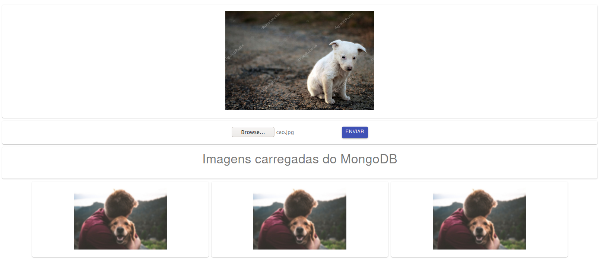

# Projeto ImageMongoDB
Exemplo de envio de arquivos de imagem e gravando com mongoDB

## Motivação
Desenvolvimento de novos projetos com javaScript, typescript. Foi criado um exemplo para adicionar imagens em banco documental com [base64](https://developer.mozilla.org/en-US/docs/Glossary/Base64).

  

  
  
  

  

  
 
## Screenshots
<h1 align="center">
    
</h1>

## Tecnologias

- [Node.js](https://nodejs.org/en/)
- [React](https://reactjs.org)